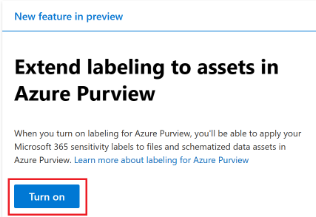
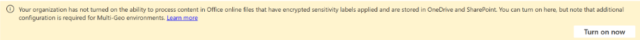
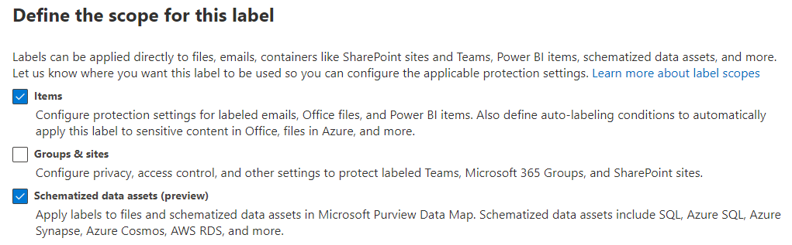
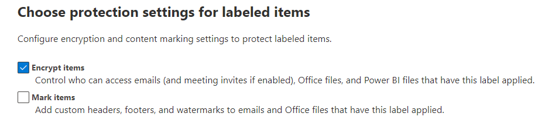
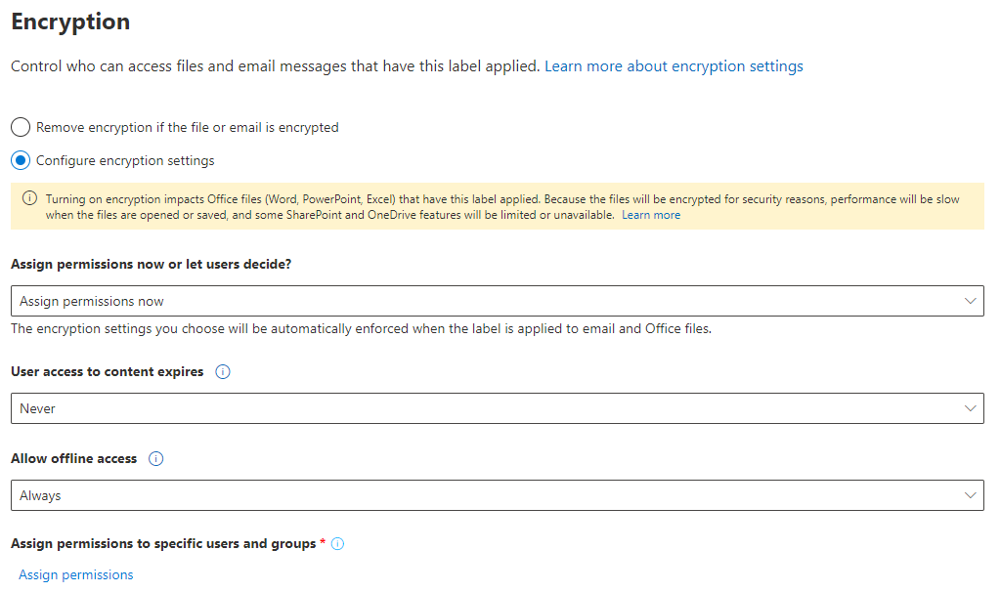
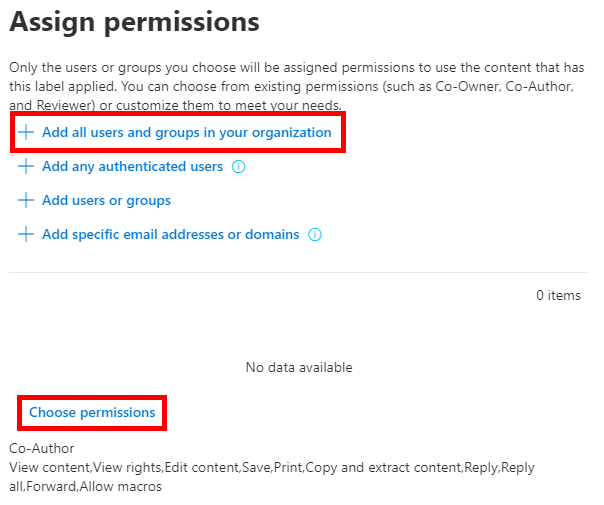

# Module 01 - CREATE SENSITIVITY LABELS

[< Previous Module](../modules/module00.md) - **[Home](../README.md)** - [Next Module >](../modules/module00.md)

## :loudspeaker: Introduction

In this task, your HR department has requested a sensitivity label to apply to HR data and files containing social security numbers. You will create a sensitivity label for Internal documents and Schematized data assets.  This label will be automatically applied to files that contain a matching condition in Microsft 365 apps, SharePoint, OneDrive for Business, and Microsoft Purview data maps.

## :thinking: Prerequisites
The following Microsoft 365 licenses are required to automatically apply sensitivity labels to your assets in Microsoft 365 and the Microsoft Purview Data Map:
* Microsoft 365 E5/A5/G5
* Microsoft 365 E5/A5/G5 Compliance
* Microsoft 365 E5/A5/G5 Information Protection, and Governance
* Office 365 E5, Enterprise Mobility + Security E5/A5/G5, and AIP Plan 2

## :dart: Objectives

* Create Sensitivity Label for Files and Schematized data assets
* Publish Label Policy
* Test label in Microsoft 365

## 1. Create Sensitivity Label

1. In Microsoft Edge, navigate to https://compliance.microsoft.com and log into the Microsoft Purview portal as user@ZZZZZZ.onmicrosoft.com (where user and ZZZZZZ are your unique user and tenant ID provided by your lab hosting provider). Your password should be provided by your lab hosting provider.

2. In the Microsoft Purview portal, on the left navigation pane, select Information protection.
    Before using Sensitivity Labels in Purview data maps, consent must be given to extend labeling to assets in Azure Purview. This step has already been taken in our lab environment but if you see the image below, you would need to click 'Turn on'.

    

    To enable sensitivity labels for Office files in SharePoint and OneDrive, click 'Turn on now' if the message appears below. This step has already been taken in our lab environement.

    

3. On the Information protection page, under the Labels tab select + Create a label.
4. The New sensitivity label wizard will start. On the Name and create a tooltip for your label page for the Name, Description for admins and Description for users, enter the following information:

    *  Name: Highly Confidential
    *  Display name: Highly Confidential
    *  Description for users: Confidential data that requires protection 
    *  Description for admins: Internal sensitivity label for Contoso
    *  Select Next.

5. On the Define the scope for this label page, select the Items and Schematized data assets (preview), and click Next.

    

6. On the Choose protection settings for labeled items page, select Encrypt and click Next.

    

7. On the Encryption page, select Configure encryption settings, Assign permissions now, Never, and Always for the drop down choices, and then click Assign permissions under Assign permissions to specific users and groups.

    

8. On the Assign permissions page, select Add all users and groups in your organization and Choose permissions as Co-Author.

    
    
On the Auto-labeling for files and emails page, select Next.

On the Define protection settings for groups and sites page, select Next.

On the Auto-labeling for schematized data assests(preview) page, select Next.

On the Review your settings and finish page, select Create label.

The label will be created and when complete a message will display: Your sensitivity label was created

Select Dont create a policy yet and then select Done.


3. STEP_PLACEHOLDER

> :bulb: **Did you know?**
>
> Did you know sections can be used to help articulate a concept, provide additional clarity, etc.

```text
Values that need to be copied/pasted should be placed in code snippets
```

<div align="right"><a href="#module-00---title">↥ back to top</a></div>

## 2. H2_TITLE

SHORT_DESCRIPTION

1. STEP_PLACEHOLDER

2. STEP_PLACEHOLDER

3. STEP_PLACEHOLDER

<div align="right"><a href="#module-00---title">↥ back to top</a></div>

## 3. H2_TITLE

SHORT_DESCRIPTION

1. STEP_PLACEHOLDER

2. STEP_PLACEHOLDER

3. STEP_PLACEHOLDER

<div align="right"><a href="#module-00---title">↥ back to top</a></div>

## :mortar_board: Knowledge Check

1. PLACEHOLDER_KNOWLEDGE_CHECK_QUESTION

    A ) Asset Type  
    B ) Classification  
    C ) Size  

2. PLACEHOLDER_KNOWLEDGE_CHECK_QUESTION

    A ) True  
    B ) False  

3. PLACEHOLDER_KNOWLEDGE_CHECK_QUESTION

    A ) True  
    B ) False  

<div align="right"><a href="#module-00---title">↥ back to top</a></div>

## :tada: Summary

MODULE_SUMMARY

[Continue >](../modules/module00.md)
