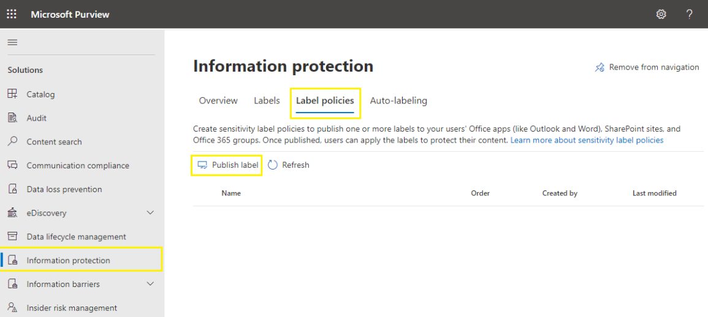

# Module 02 - PUBLISH SENSITIVITY LABELS BY CREATING A LABEL POLICY

[< Previous Module](../modules.md/module01.md) - **[Home](../modules.md/module00.md)** - [Next Module >](../modules.md/module03.md)

## :loudspeaker: Introduction

You make your sensitivity labels available to users by publishing them in a sensitivity label policy that appears in a list on the Label policies page. Just like sensitivity labels, the order of the sensitivity label policies is important because it reflects their priority. The label policy with lowest priority is shown at the top of the list with the lowest order number, and the label policy with the highest priority is shown at the bottom of the list with the highest order number.

A label policy consists of:
* A set of labels.
* The users and groups that will be assigned the policy with labels.
* The scope of the policy and policy settings for that scope (such as default label for files and emails).

You can include a user in multiple label policies, and the user will get all the sensitivity labels and settings from those policies. If there is a conflict in settings from multiple policies, the settings from the policy with the highest priority (highest order number) is applied. In other words, the highest priority wins for each setting.

In this task, we will add our new Sensitivity Label to a new label policy.

<!--## :thinking: Prerequisites

* Microsoft 365 E5/A5/G5
* Microsoft 365 E5/A5/G5 Compliance
* Microsoft 365 E5/A5/G5 Information Protection, and Governance
* Office 365 E5, Enterprise Mobility + Security E5/A5/G5, and AIP Plan 2 -->

## :dart: Objectives

* Create and Publish a new Label Policy for our Sensitivity Label created in the previous lab module.

## Publish Label Policy

1. From the [Microsoft Purivew Compliance Portal](https://compliance.microsoft.com), select Solutions > Information Protection > Label Policies

2. On the **Label policies** page, select **Publish label** to start the **Create policy** configuration:

    

3. On the **Choose sensitivity labels to publish** page, select the **Choose sensitivity labels to publish** link. Select the label (Highly Confidential) that you want to make available in apps and to services, and then select **Add**.

4. Review the selected labels and to make any changes, select **Edit**. Otherwise, select **Next**.

5. Follow the prompts to configure the policy settings.
    The policy settings that you see match the scope of the labels that you selected. For example, if you selected labels that have just the **Items** scope, you don't see the policy settings **Apply this label by default to groups and sites** and **Require users to apply a label to their groups and sites**.

    For labels configured for **Microsoft Purview Data Map assets (preview)**: These labels don't have any associated policy settings.

    **For this lab we will accept the default values and not make any selections until we get to the Name your policy screen.**

6. On the Name your policy screen, give your new policy a name like HR Data policy and click next.  Completing the **Create policy** configuration automatically publishes the label policy. To make changes to a published policy, simply edit it. There's no specific publish or republish action for you to select.

## When to expect new labels and changes to take effect

For labels and label policy settings, allow 24 hours for the changes to propagate through the services. There are many external dependencies that each have their own timing cycles, so it's a good idea to wait this 24-hour time period before you spend time troubleshooting labels and label policies for recent changes.

However, there are some scenarios where label and label policy changes can take effect much faster or be longer than 24 hours. For example, for new and deleted sensitivity labels for Word, Excel, and PowerPoint on the web, you might see updates replicate within the hour. But for configurations that depend on populating a new group and group membership changes, or network replication latency and bandwidth restrictions, these changes might take 24-48 hours.

## :tada: CONGRATULATIONS!
You've just published your first Label Policy!  In the next module, you will test this sensitivity label using a SharePoint document library and Word online.

MODULE_SUMMARY

[Continue >](../modules/module00.md)
