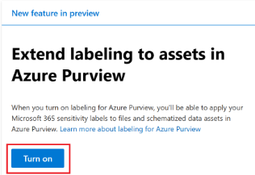
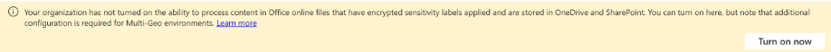
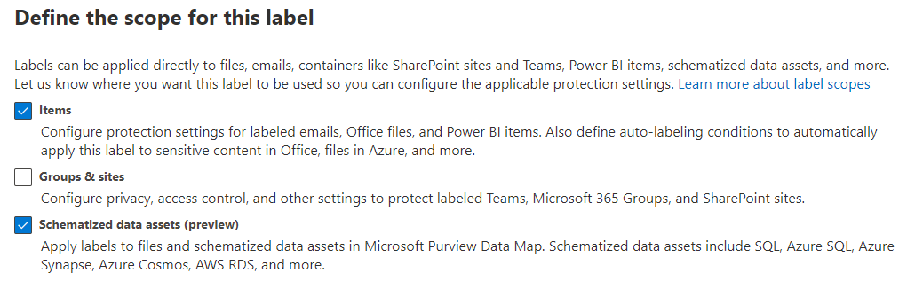

# Module 02 - PUBLISH SENSITIVITY LABELS

[< Previous Module](../modules/module00.md) - **[Home](../README.md)** - [Next Module >](../modules/module00.md)

## :loudspeaker: Introduction

You make your sensitivity labels available to users by publishing them in a sensitivity label policy that appears in a list on the Label policies page. Just like sensitivity labels, the order of the sensitivity label policies is important because it reflects their priority: The label policy with lowest priority is shown at the top of the list with the lowest order number, and the label policy with the highest priority is shown at the bottom of the list with the highest order number.

A label policy consists of:
* A set of labels.
* The users and groups that will be assigned the policy with labels.
* The scope of the policy and policy settings for that scope (such as default label for files and emails).

You can include a user in multiple label policies, and the user will get all the sensitivity labels and settings from those policies. If there is a conflict in settings from multiple policies, the settings from the policy with the highest priority (highest order number) is applied. In other words, the highest priority wins for each setting.

In this task, we will add our new Sensitivity Label to an existing policy that has already been published.

<!--## :thinking: Prerequisites

* Microsoft 365 E5/A5/G5
* Microsoft 365 E5/A5/G5 Compliance
* Microsoft 365 E5/A5/G5 Information Protection, and Governance
* Office 365 E5, Enterprise Mobility + Security E5/A5/G5, and AIP Plan 2 -->

## :dart: Objectives

* Create Sensitivity Label for Files and Schematized data assets
* Publish Label Policy
* Test label in Microsoft 365

## 1. Create Sensitivity Label

1. In Microsoft Edge, navigate to https://compliance.microsoft.com and log into the Microsoft Purview portal as user@ZZZZZZ.onmicrosoft.com (where user and ZZZZZZ are your unique user and tenant ID provided by your lab hosting provider). Your password should be provided by your lab hosting provider.

2. In the Microsoft Purview portal, on the left navigation pane, select Information protection.
    Before using Sensitivity Labels in Purview data maps, consent must be given to extend labeling to assets in Azure Purview. This step has already been taken in our lab environment but if you see the image below, you would need to click 'Turn on'.

    

    To enable sensitivity labels for Office files in SharePoint and OneDrive, click 'Turn on now' if the message appears below. This step has already been taken in our lab environement.

    

3. On the Information protection page, under the Labels tab select + Create a label.
4. The New sensitivity label wizard will start. On the Name and create a tooltip for your label page for the Name, Description for admins and Description for users, enter the following information:

    *  Name: Highly Confidential
    *  Display name: Highly Confidential
    *  Description for users: Confidential data that requires protection 
    *  Description for admins: Internal sensitivity label for Contoso
    *  Select Next.

5. On the Define the scope for this label page, select the Items and Schematized data assets (preview), and click Next.

    

6. On the Choose protection settings for labeled items page, select Encrypt and click Next.

    

7. On the Encryption page, select Configure encryption settings, Assign permissions now, Never, and Always for the drop down choices, and then click Assign permissions under Assign permissions to specific users and groups.

    

8. On the Assign permissions page, select Add all users and groups in your organization and Choose permissions as Co-Author, click Save, and then click Next.

    

9. On the Auto-labeling for files and emails page, click to enable Auto-labeling for files and emails and define the condition below:
    - Click Add condition
    - Click Content contains
    - Click Add and select Sensitive info types
    - Search for social and checkbox select U.S. Social Security Number and click Add
    - Click Next

    

10. On the Define protection settings for groups and sites page do not make any selections, select Next.

11. On the Auto-labeling for schematized data assests(preview) page click to enable, click Choose sensitive info types, search for social security number, select U.S. Social Security Number (SSN), click Add, and select Next.

    

12. On the Review your settings and finish page, select Create label.  The label will be created and when complete a message will display: Your sensitivity label was created.  Select Dont create a policy yet and then select Done.

## :tada: CONGRATULATIONS!
You've just created your first Sensitivity Label.  In the next module, you will Publish this Sensitivity Label to make it available across your apps and services.

MODULE_SUMMARY

[Continue >](../modules/module00.md)
