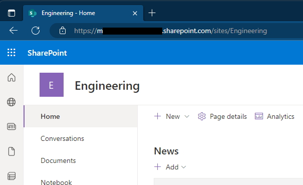
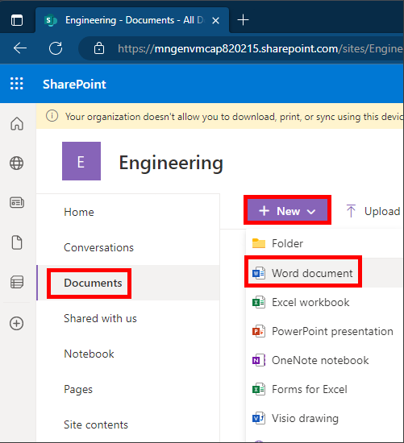
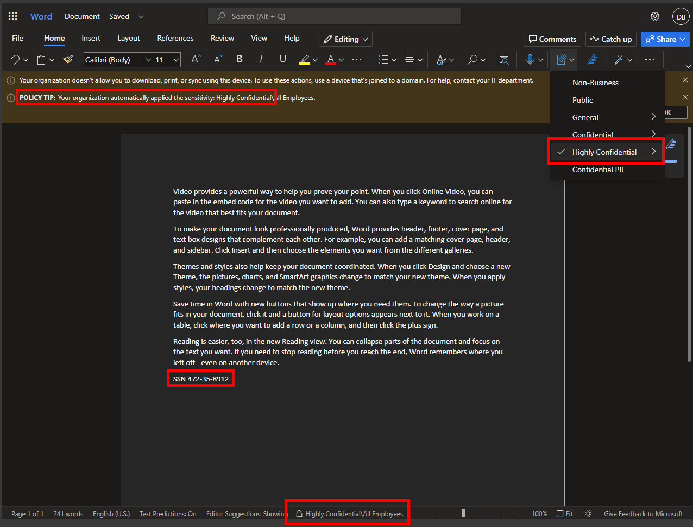

# Module 03 - TEST SENSITIVITY LABEL IN SHAREPOINT

[< Previous Module](../modules.md/module02.md) - **[Home](../modules.md/module00.md)** - [Next Module >](../modules.md/module04a.md)

## :loudspeaker: Introduction

After creating a **Sensitivity Label** and publishing a **Label Policy**, it's time to test the new label. It can take between 1 and 24 hours for the Sensitivity Label to appear throughout the services.  There are many external dependencies that each have their own timing cycles, so it's a good idea to wait this 24-hour time period before you spend time troubleshooting labels and label policies for recent changes.

However, there are some scenarios where label and label policy changes can take effect much faster or be longer than 24 hours. For example, for new and deleted sensitivity labels for Word, Excel, and PowerPoint on the web, you might see updates replicate within the hour. But for configurations that depend on populating a new group and group membership changes, or network replication latency and bandwidth restrictions, these changes might take 24-48 hours.

## :dart: Objectives

* Test Sensitivity Labels in SharePoint Online

## Create documents in a SPO doc library to test

1. Navigate to the engineering site collection in SharePoint Online in your tenant. This is typically https://domain.sharepoint.com/sites/Engineering where domain is the name of your lab tenant.

    

2. Click **Documents**, **New**, and **Word Document** to create a new Word document in this doc library.

    

3. In the new Word document, type =rand(5) to populate the document with sample text. Below the final paragraph enter a social security number, for example:  SSN 472-35-8912

    

4. You can also confirm that the Sensitivity Labels have propogated into the Microsoft 365 service by viewing the Sensitivity Label button on the ribbon in the Word application as seen in the image above.

## :tada: CONGRATULATIONS!
In this lab you tested the Sensitivity Label and Label Policy to confirm it has been configured properly and is successfully labeling when finding a matching condition in the file.

[Continue >](../modules/module04a.md)
